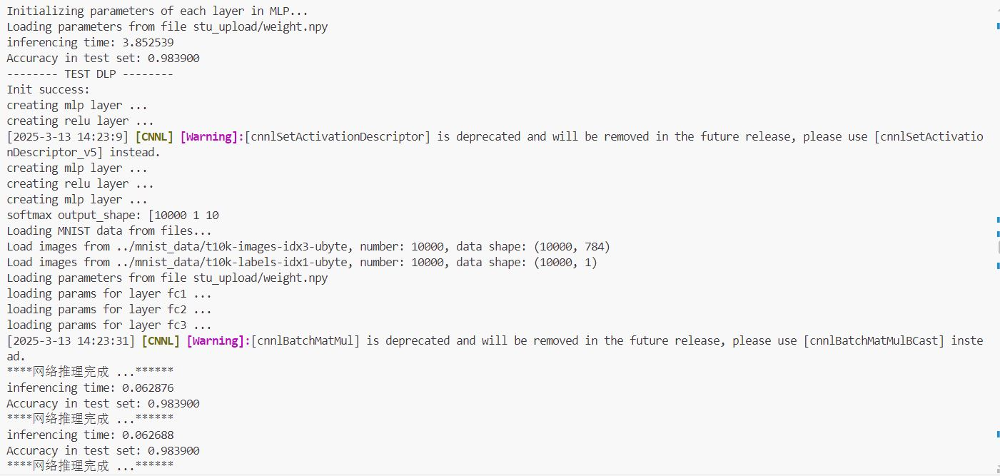

# 2025国科大智能计算系统实验分享
## 仅供分享与交流
## exp_2（100分）：
主要的改进思路是增加神经元数目，本人用的256-512  
注意这里神经元数目太多会使DLP平台内存溢出，但是如果要提高DLP/CPU的耗时比又需要提高神经元数目。  
这里选择256-512，最终CPU测试时间为3.852539，DLP测试时间0.062688  

但是希冀平台CPU貌似跑的快一些，CPU只用了2.多，所以这里为了保全分数在fc层里加了sleep(2)，完美解决
## exp_3（100分）：
网络搭建容易马虎出错，需要瞪大眼睛仔细看
